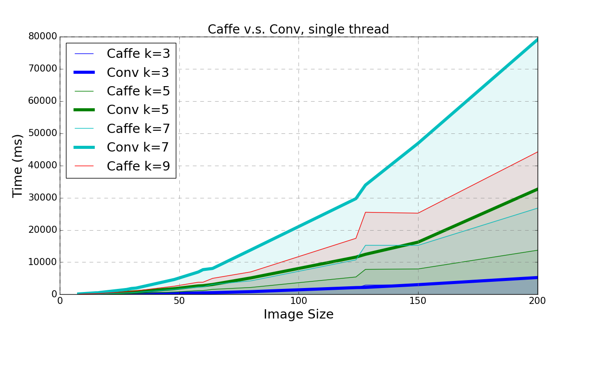
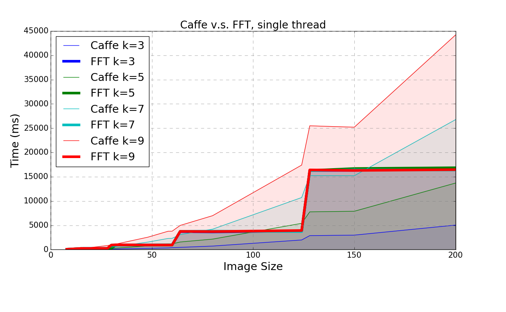

# haDNN

A proof-of-concept CNN implementation in Halide.

Convolution layers were implemented in both direct-conv and FFT. Single thread benchmark compared to Caffe (GEMM):

Conv is comparable to Caffe GEMM when k=3. FFT is significantly faster when k >= 5.

In multithread settings Halide will also scale better than Caffe.
